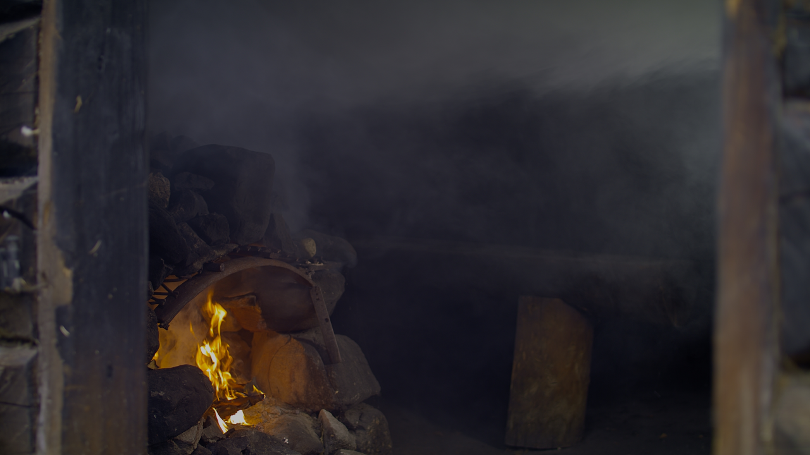

Open Content, for education, usage and exploration, enjoy! 

## Open Content 

### SVT Open Content Video Test Suite 2021 – Nature’s Complexity 
###  

A data set of video material intendented for R&D, with a liberal usage license.

TODO:
* add a featurelist of the videos, short description.
* access information (ftp?)  

All of the sequences from this suite were produced and post processed with the intention to help SVT’s internal OTT Video R&D team evaluate and assess video quality produced by encoders and codecs.
All of the material of this suite may be distributed, modified and used freely (complete or in parts) as per the license described further down below.

All of the content was shot at 3840x2160p50 using professional equipment, and the outmost care has been taken during the post-production process to ensure that visual quality is retained. The data itself is provided in various different resolutions and formats, both graded and ungraded.

License: [CC BY-SA 4.0](https://creativecommons.org/licenses/by-sa/4.0/)
